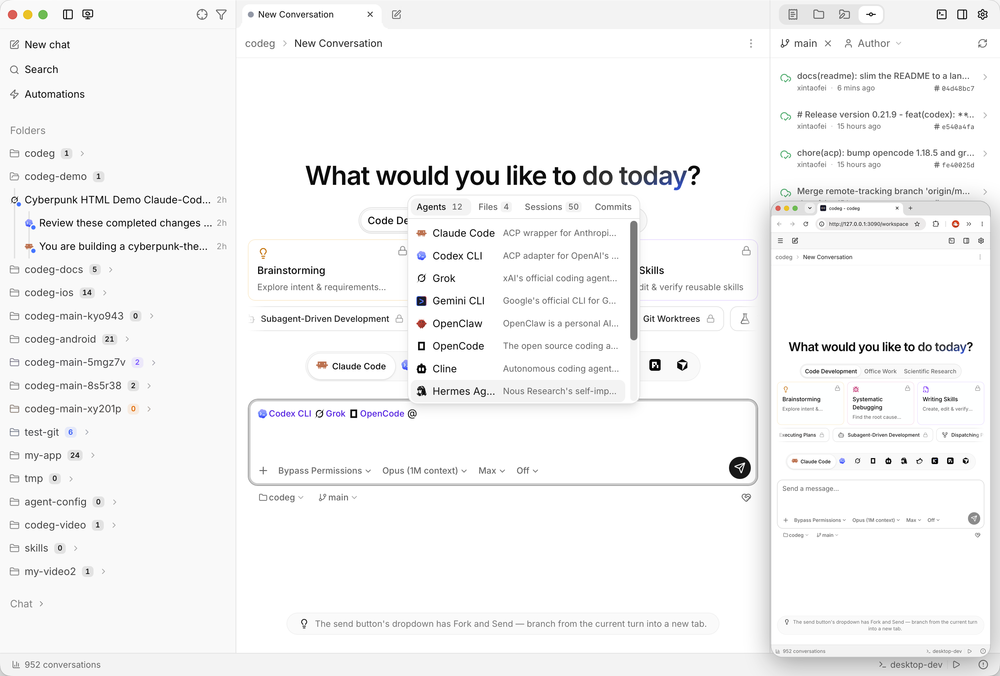

<h1 align="center">
   Codeg, versión personalizada
</h1>

<p align="center">
  <a href="https://github.com/keh4l/codeg/releases/latest"></a>
  <a href="https://github.com/spacering-net/codeg"></a>
  <a href="../../LICENSE"></a>
</p>

<p align="center">
  <sub><a href="../../README.md">简体中文</a> · <a href="./README.en.md">English</a> · <a href="./README.zh-TW.md">繁體中文</a> · <a href="./README.ja.md">日本語</a> · <a href="./README.ko.md">한국어</a> · <strong>Español</strong> · <a href="./README.de.md">Deutsch</a> · <a href="./README.fr.md">Français</a> · <a href="./README.pt.md">Português</a> · <a href="./README.ar.md">العربية</a></sub>
</p>

<p align="center">
  <strong><a href="https://github.com/spacering-net/codeg">Codeg</a>, el espacio de trabajo multiagente de xintaofei, personalizado por keh4l</strong><br/>
  Todos tus agentes de programación con IA en un solo lugar, trabajando juntos. Sigue de cerca al proyecto original y añade algunas funciones.
</p>

<h3 align="center"><a href="https://github.com/keh4l/codeg/releases/latest"><ins>Descargar</ins></a> · <a href="#instalación"><ins>Instalación</ins></a> · <a href="https://docs.codeg.app"><ins>Documentación oficial</ins></a></h3>

<p align="center">
  <picture>
    <source media="(prefers-color-scheme: dark)" srcset="../images/workspace-dark.png" />
    
  </picture>
</p>

## Diferencias con la versión oficial

<table>
  <tr>
    <td width="50%" valign="top">🤖 <strong>Kiro CLI integrado</strong><br/>Usa el <code>kiro-cli</code> que ya instalaste: elige modelo y modo, añade servidores MCP y skills, y reanuda sesiones anteriores.</td>
    <td width="50%" valign="top">🪟 <strong>Pestañas por ventana</strong><br/>Las ventanas del navegador sobre un mismo servidor ya no siguen las pestañas de las demás; conversaciones y mensajes se siguen sincronizando.</td>
  </tr>
  <tr>
    <td width="50%" valign="top">💭 <strong>Claude Code muestra su pensamiento</strong><br/>Pide a la API resúmenes del pensamiento, así que esa sección ya no aparece vacía.</td>
    <td width="50%" valign="top">🔄 <strong>Al día con el original</strong><br/>Los cambios del proyecto original se incorporan con regularidad; lo que no aparece aquí funciona igual que en la versión oficial.</td>
  </tr>
</table>

<details>
<summary><strong>Kiro CLI integrado</strong>: detalles</summary>
<br/>

- Ejecuta el `kiro-cli` que instalaste con el [instalador oficial de Kiro](https://kiro.dev/docs/getting-started/installation/).
- En el compositor eliges su modelo, modo, esfuerzo de razonamiento y pensamiento, y puedes usar sus comandos de barra.
- Modo de permisos: preguntar cada vez, o confiar en todas las herramientas.
- Puedes darle servidores MCP y skills, e importar y reanudar sus sesiones anteriores.
- Actualizar, en Ajustes → Agentes, ejecuta el propio actualizador de Kiro.
- Las conversaciones que tenías con Kiro como agente personalizado pasan al agente integrado.
- Propuesto al proyecto original: [spacering-net/codeg#851](https://github.com/spacering-net/codeg/pull/851).

</details>

<details>
<summary><strong>Pestañas por ventana</strong>: detalles</summary>
<br/>

- Abrir, enfocar o cerrar una pestaña de conversación en una ventana deja las demás como estaban.
- Al recargar vuelven las pestañas de esa ventana.
- Las conversaciones, los mensajes y las eliminaciones siguen llegando a todas las ventanas.
- Es el interruptor «Sincronizar pestañas de conversación entre ventanas» en Ajustes → General: desactivado por defecto en el navegador y activado en la aplicación de escritorio. Activado, todas las ventanas comparten un mismo conjunto de pestañas, como en la versión oficial.
- Solicitado al proyecto original en [spacering-net/codeg#547](https://github.com/spacering-net/codeg/issues/547).

</details>

<details>
<summary><strong>Claude Code muestra su pensamiento</strong>: detalles</summary>
<br/>

- Con los modelos recientes, la versión oficial solo recibe una firma cifrada por cada bloque de pensamiento, así que el pensamiento de Claude aparece vacío.
- Esta versión pide a la API resúmenes del pensamiento: lo mismo que muestra `claude` en la terminal con `showThinkingSummaries` activado.
- Para desactivarlo, añade esto a `~/.claude/settings.json` (o al `.claude/settings.json` de un proyecto):

  ```json
  "showThinkingSummaries": false
  ```

- El pensamiento de conversaciones anteriores nunca se llegó a enviar, así que no se puede recuperar.

</details>

### Publicación

|  | Esta versión | Versión oficial |
| --- | --- | --- |
| Descargas y actualizaciones | [Releases](https://github.com/keh4l/codeg/releases) de este repositorio, firmadas con la clave propia de este fork | Releases de [spacering-net/codeg](https://github.com/spacering-net/codeg/releases) |
| Versión | `<versión original>-<n>`: `0.33.0-2` es la 2.ª versión basada en la 0.33.0 original | p. ej. `0.33.0` |
| Notarización en macOS | No; hay que permitirla una vez al abrirla por primera vez (ver [Instalación](#instalación)) | Sí |
| Imagen de Docker | No | Sí |

Las actualizaciones no se cruzan: esta versión nunca se actualiza a una versión oficial, ni una versión oficial a esta. La rama `keh4l` es la rama `main` del proyecto original más los cambios de arriba.

## Instalación

### Escritorio

Descarga el instalador más reciente desde [Releases](https://github.com/keh4l/codeg/releases/latest):

| Sistema | Instalador |
| --- | --- |
| macOS (Apple Silicon o Intel) | `.dmg` |
| Windows (x64 o ARM64) | `-setup.exe` |
| Linux | `.deb`, `.rpm` o `.AppImage` |

Se instala como la misma aplicación que el Codeg oficial: lo sustituye y conserva tus conversaciones y ajustes.

> [!NOTE]
> En macOS, si al abrirla por primera vez dice que la app está dañada o que no se puede abrir, ejecuta esto una vez, o permítela en Ajustes del Sistema → Privacidad y seguridad:
>
> ```bash
> xattr -cr /Applications/codeg.app
> ```

### Servidor

Linux o macOS:

```bash
curl -fsSL https://raw.githubusercontent.com/keh4l/codeg/keh4l/install.sh | bash
CODEG_STATIC_DIR=/usr/local/share/codeg/web codeg-server
```

Windows (PowerShell):

```powershell
irm https://raw.githubusercontent.com/keh4l/codeg/keh4l/install.ps1 | iex
$env:CODEG_STATIC_DIR="$env:LOCALAPPDATA\codeg\web"; codeg-server
```

Ambos instalan desde las versiones de este repositorio, y el actualizador integrado del servidor también las usa.

### Volver a la versión oficial

> [!WARNING]
> Haz primero una copia de seguridad de tus datos de Codeg. Esta versión añade una migración de base de datos para Kiro, y una versión oficial que no la tenga puede negarse a arrancar con esos mismos datos.

## Documentación

Para funciones, configuración y uso, consulta el [README](https://github.com/spacering-net/codeg/blob/main/docs/readme/README.es.md) oficial y [docs.codeg.app](https://docs.codeg.app). Describen la versión oficial; las diferencias están arriba.

## Licencia y agradecimientos

Apache-2.0, consulta [LICENSE](../../LICENSE). Codeg lo crean [xintaofei](https://github.com/xintaofei) y sus colaboradores; esta versión solo le añade cosas. Codeg se apoya en [Agent Client Protocol](https://agentclientprotocol.com), [Superpowers](https://github.com/obra/superpowers), [OfficeCLI](https://github.com/iOfficeAI/OfficeCLI) y [scientific-agent-skills](https://github.com/K-Dense-AI/scientific-agent-skills).
